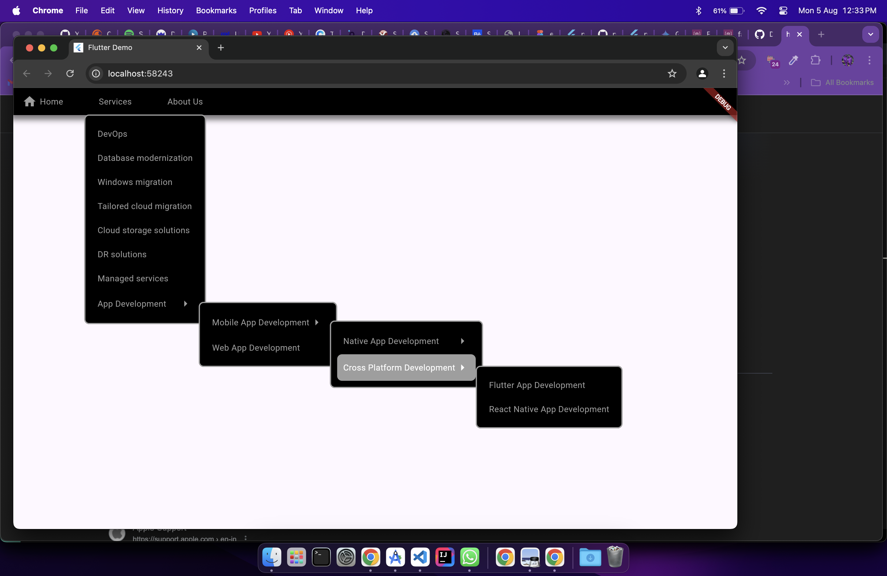

# Nested Menu Bar

Nested Menu Bar is a horizontal menu ber for flutter.Based on [PlutoMenuBar]("https://github.com/bosskmk/pluto_menu_bar").

## Features

- Multiple sub-menu : You can add multiple sub-menu in a menu.Add as many as you want.
- Customizable : You can customize the menu bar as you want.You can also customize the sub-menu pop up and the sub-menu items.
- Checkbox, Radio, Icon, Text : You can add checkbox, radio, icon, text in the menu items.
- Different types of menu : You can open the sub-menu in different onTap and onHover.
- Easy to use : You can easily use the menu bar in your project.

## Getting started

Get the package from pub.dev by adding the following to your `pubspec.yaml`:

```yaml
dependencies:
  nested_menu_bar: ^0.0.1
```

## Usage

```dart
import 'package:flutter/material.dart';
import 'package:multiple_sub_menu/packages/nested_menu_bar/lib/nested_menu_bar.dart';

void main() {
  runApp(const MyApp());
}

class MyApp extends StatelessWidget {
  const MyApp({super.key});

  // This widget is the root of your application.
  @override
  Widget build(BuildContext context) {
    return MaterialApp(
      title: 'Flutter Demo',
      theme: ThemeData(
        colorScheme: ColorScheme.fromSeed(seedColor: Colors.deepPurple),
        useMaterial3: true,
      ),
      home: const MyHomePage(title: 'Flutter Demo Home Page'),
    );
  }
}

class MyHomePage extends StatefulWidget {
  const MyHomePage({super.key, required this.title});
  final String title;

  @override
  State<MyHomePage> createState() => _MyHomePageState();
}

class _MyHomePageState extends State<MyHomePage> {
  late final List<NestedMenuItem> hoverMenu;
  @override
  void initState() {
    super.initState();
    hoverMenu = _makeMenus(context);
  }

  void message(context, String text) {
    ScaffoldMessenger.of(context).hideCurrentSnackBar();

    final snackBar = SnackBar(
      content: Text(text),
    );

    ScaffoldMessenger.of(context).showSnackBar(snackBar);
  }

  @override
  Widget build(BuildContext context) {
    return Scaffold(
      body: SingleChildScrollView(
        child:  NestedMenuBar(
          menus: hoverMenu,
          popUpMenuItemBorderRadius: 8,
          menuBarDecoration: BoxDecoration(
            color: Colors.black,
            boxShadow: [
              BoxShadow(
                color: Colors.black.withOpacity(0.5),
                spreadRadius: 5,
                blurRadius: 7,
                offset: const Offset(0, 3),
              ),
            ],
          ),
          menuBarItemHoverColor: Colors.white,
          menuBarItemColor: Colors.grey,
          popUpDecoration: BoxDecoration(
            color: Colors.black,
            border: Border.all(color: Colors.grey,width: 2),
            borderRadius: BorderRadius.circular(8),
          ),
          popUpPadding: 10,
          popUpMenuItemHoverForegroundColor:  Colors.white,
          popUpMenuItemForegroundColor: Colors.grey,
          popUpMenuItemBackgroundColor: Colors.black,
          popUpMenuItemHoverBackgroundColor: Colors.grey,
        ),
      )
    );
  }
  
  List<NestedMenuItem> _makeMenus(BuildContext context) {
    return [
      NestedMenuItem(
        title: "Home",
        icon: Icons.home,
        onTap: () => message(context, "Home"),
      ),
      NestedMenuItem(
        title: "Services",
        children: [
            NestedMenuItem(title: "DevOps",onTap: () => message(context, "DevOps"),),
            NestedMenuItem(title: "Database modernization",onTap: () => message(context, "Database modernization"),),
            NestedMenuItem(title: "Windows migration",onTap: () => message(context, "Windows migration"),),
            NestedMenuItem(title: "Tailored cloud migration",onTap: () => message(context, "Tailored cloud migration"),),
            NestedMenuItem(title: "Cloud storage solutions",onTap: () => message(context, "Cloud storage solutions"),),
            NestedMenuItem(title: "DR solutions",onTap: () => message(context, "DR solutions"),),
            NestedMenuItem(title: "Managed services",onTap: () => message(context, "Managed services"),),
            NestedMenuItem(title: "App Development",onTap: () => message(context, "App Development"),
              children: [
                NestedMenuItem(title: "Mobile App Development",
                onTap: () => message(context, "Mobile App Development"),
                children: [
                  NestedMenuItem(title: "Native App Development",onTap: () => message(context, "Native App Development"),
                  children: [
                    NestedMenuItem(title: "Android App Development",onTap: () => message(context, "Android App Development"),),
                    NestedMenuItem(title: "iOS App Development",onTap: () => message(context, "iOS App Development"),),
                  ]
                  ),
                  NestedMenuItem(title: "Cross Platform Development",onTap: () => message(context, "Cross Platform Development"),
                  children: [
                    NestedMenuItem(title: "Flutter App Development",onTap: () => message(context, "Flutter App Development"),),
                    NestedMenuItem(title: "React Native App Development",onTap: () => message(context, "React Native App Development"),),
                  ]
                  
                  ),
                ]
                ),
                NestedMenuItem(title: "Web App Development",onTap: () => message(context, "Web App Development"),),
              ]
            ),
        ]
      ),
      NestedMenuItem(
        title: "About Us",
      ),
    ];
  }

}
```

## Screenshots

|                            Example                            |
|:----------------------------------------------------------------------:|
||

## Additional information

- For help on editing package code, view the [documentation](https://flutter.dev/docs/development/packages-and-plugins/developing-packages).
